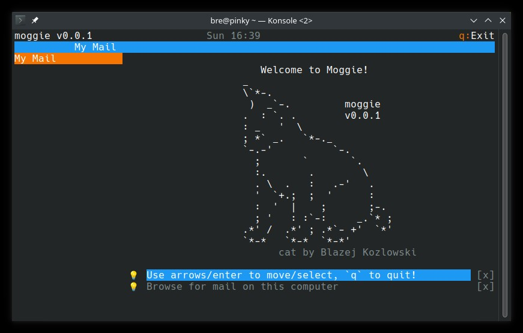
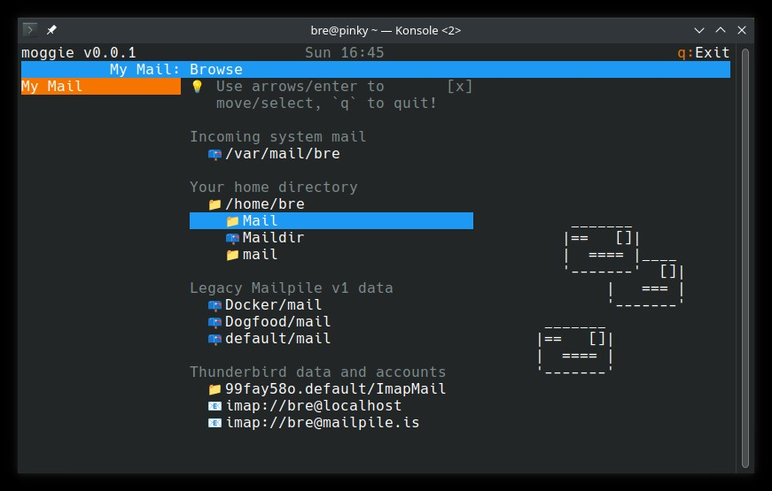
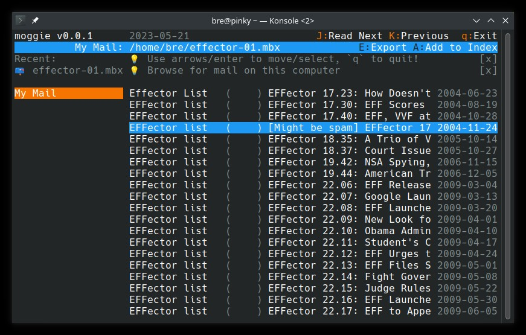
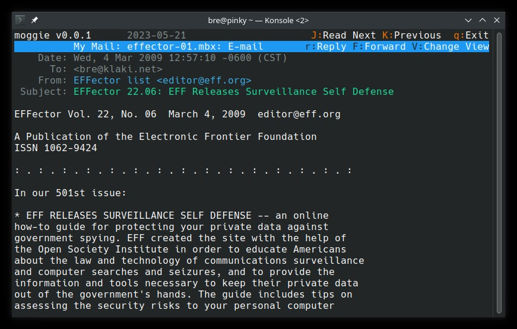

Subject: Making moggie, Part 1: A Read-Only Mail Client
Type: blog2
Author: Bjarni Rúnar
Date: 13 July, 2023
Prism: Yes

*This is the first in
[a series of six blog posts](/blog/2023-05-01_A_Mail_Client_in_Six_Steps.html)
about writing the moggie terminal-mode e-mail client.*

## Table of Contents                                                       #=#

<!-- TOC: h2 h3 -->

## Non-technical introduction                                          #=intro

In this post I will attempt to explain how the read-only functionality of moggie's text-user-interface (TUI) e-mail client is implemented,
as a rough guide to others who might want to write their own e-mail client using the moggie back-end.

So most of this post will be documenting the development itself,
and it might get quite long!
But first,
let's skip to the end and discuss what it looks like and how to use it.

Instructions on how to install the development version of Moggie are on the project's main README in Github, so I won't be repeating them here.
[Go take a peek, install the code if you like](https://github.com/mailpile/moggie/),
we'll be here when you get back.  OK? ... Welcome back!

### Using moggie as a mail client                         #=moggie-as-a-client

Once you have moggie and its prerequisites installed,
launching the moggie mail client can be done like so:

<pre class="add-bottom"><code class="language-bash">
# Run moggie!
python3 -m moggie
</code></pre>

This should result in something that looks a bit like this:

There's not much to see,
but there are a few things worth mentioning.
One, is that moggie is a "responsive" console application
- just like a responsive web app, moggie will show more or less at once depending on how large the terminal is.
Although it will work just fine in 80x25 as pictured above,
moggie will make pretty good use of the space if you give it more!

In all cases,
the top two lines of the screen are dedicated to information about what you are currently looking at,
and a list of available hot-keys.

To the left is a side-bar which (when visible,
it may disappear to make room for other things) gives a summary of your configured "contexts", accounts and tags.
Since this moggie is brand new,
with nothing configured,
the side-bar is pretty boring.
That will change later in this series of blog posts,
as the app evolves and we expose more of moggie's back-end capabilities.

Moggie also tries to provide context-sensitive hints on how to use the app;
they show up in various places,
prefixed with a light-bulb emoji and can be dismissed by selecting the `[x]` and pressing `ENTER`.

So how do we read some mail?

Well, that depends on where the mail is.
Press `q` to exit the app and try one of these:

<pre class="add-bottom"><code class="language-bash">
# See what Moggie suggests we explore
python3 -m moggie -y

# Explore a local directory (browsing for maiboxes)
python3 -m moggie -y -f /path/to/folder/

# Connect to a remote IMAP server
python3 -m moggie -y -f imap://username@imap.example.org/
</code></pre>

The first two will read files which are already on your filesystem,
the third will attempt to log on to a remote IMAP mail server,
prompting you for a password as it goes,
and finally present you with a list of mailboxes.

You should be able to use the arrow keys or vi-style `jk` to move up and down in the list,
and press `ENTER` to select a mailbox or open up a subdirectory.
Or press `q` and select a mailbox from the shell, like so:

<pre class="add-bottom"><code class="language-bash">
# Open a local Maildir directly
python3 -m moggie -f /path/to/Maildir

# Open a local mbox file directly
python3 -m moggie -f /path/to/archive.mbox

# Read a remote IMAP mailbox directly
python3 -m moggie -f imap://username@imap.example.org/INBOX
</code></pre>

Once you have selected a mailbox,
you should be presented with a list that looks a bit like this:

(This view is what you get from opening a mailbox from the shell
- if you had selected one from moggie's internal file browser,
you would have the file browser on the left instead of the main side-bar.)

You should be able to use the arrow keys or vi-style `jk` to move up and down in the list, and press `ENTER` to read an e-mail:

If you have GnuPG installed and encrypted e-mail in your mailbox,
you should be able to open up an encrypted or signed message and see how the user interface prompts for a passphrase and explains the security properties of the message.

Speaking of explanations
- if you want more information about the structure and attributes of the e-mail, press the `V` (capital-V) from the message view.
This will toggle the display mode between "human friendly", "technical details" and "raw message source".
The technical details explain everything moggie knows about the message,
which could be helpful for troubleshooting or other technical work.

This report, as well as all of the data behind the screens above,
is also available from the command-line as text or JSON,
or over an HTTP API.

Read on to learn more about those APIs.

------------------------------------------------------------------------------

## A More Technical Introduction                                  #=tech-intro

The "TUI" application demonstrated above is a **client** which communicates with the moggie **API server** using HTTP (a websocket, actually).
So although it is running in a terminal,
it is using web technology behind the scenes.

If the server is not running,
the app will launch it automatically and shut it down upon exit,
so users don't really need to know this technicality.
But if you want to develop your own front-end,
or interact with moggie using shell commands,
then this becomes more important.

The app (on Unix-like operating systems) will keep its configuration,
state, logs, and various data files in a subdirectory below
`~/.local/share/Moggie/` - usually named `default` unless the user has multiple app profiles configured.

### App lifecycle                                                  #=lifecycle

To start, restart or stop the moggie API server:

<pre class="add-bottom"><code class="language-bash">
# Start the API server (in the background)
python3 -m moggie start

# Restart the API server (starting if not already running)
python3 -m moggie restart

# Shut down the API server
python3 -m moggie stop 
</code></pre>

If you have enabled moggie's application lock (encrypted local data),
you may also want to know about the `moggie unlock` command.

Again,
all of these steps happen automatically if the user is just using moggie as a mail client.
But power users and developers will want direct control over whether the server is running or not.

### Configuration                                              #=configuration

Moggie's default configuration file is
`~/.local/share/Moggie/default/config.rc`.

This file uses a relatively common syntax,
with the addition that some values may be encrypted to avoid leaking user secrets.

Note that moggie may rewrite the configuration file as it runs,
so if you want to edit it by hand,
be sure to shut the server down first.

### Logs                                                                #=logs

Like most servers,
moggie writes logs to disk to assist with troubleshooting.
These logs are by default stored `~/.local/share/Moggie/default/logs`,
and they are rotated and expired automatically.

There are multiple log files,
one for each of moggie's internal "microprocesses".

The log named `moggie` is written to by the user facing TUI and CLI apps.

You can increase the log verbosity by editing the configuration file and adjusting the `log_level` value in the `[App]` section.
The default is a relatively quiet 40,
lowering this to 10 will enable a lot of debugging output.
Remember to stop the moggie server before editing the configuration file.

### The moggie CLI / API                                             #=cli-api

Moggie exposes a rich,
powerful set of tools to the command line.

Some of these commands are inspired by the `notmuch` e-mail search tool,
and where moggie's features overlap with those of notmuch,
an attempt has been made to make them compatible.
Speaking of inspiration,
moggie's e-mail app is largely inspired by the classic `mutt` and it strives to make mutt users feel at home.

One of the things that makes moggie unique,
is that there is an almost 1:1 mapping between the features exposed as command-line tools,
and those exposed over HTTP and websockets as an API.

Some examples (click the tabs):

  <small style='float: right'><i>click the tabs for more examples</i></small>
  <ul class="tab-labels">
    <li data-tab="cli"  class="tab-cli  show">command line</li>
    <li data-tab="curl" class="tab-curl"     >simple web</li>
    <li data-tab="json" class="tab-json"     >JSON web</li>
    <li data-tab="ws"   class="tab-ws"       >websockets</li>
  </ul>
<pre class="add-bottom tab tab-cli show"><code class="language-bash">
# Search for some e-mail
python3 -m moggie search --limit=5 from:bre
</code> <code class="language-none output">
id:000000008137 2023-04-24 [1/1] Congratulation to bre; FYI!!! (inbox)
id:000000008120 2023-04-23 [1/1] Bjarni Rúnar Einarsson; Gail's 2023-04-23 (inbox)
id:000000007996 2023-04-17 [1/1] Bjarni Runar Einarsson; Your personal data has leaked due to suspected harmful activities. (inbox)
id:000000007932 2023-04-13 [1/1] Bjarni Runar Einarsson; Your personal data has leaked due to suspected harmful activities. (inbox)
id:000000007556 2023-03-28 [1/1] Bjarni Rúnar Einarsson; Kaktus 2023-03-28 (inbox)
</code></pre>
<pre class="add-bottom tab tab-curl"><code class="language-bash">
# The same thing, using a web request
URL=$(cat ~/.local/share/Moggie/default/workers/app.url)
curl "$URL/cli/search/--format=text/--limit=5/from:bre"
</code> <code class="language-none output">
id:000000008137 2023-04-24 [1/1] Congratulation to bre; FYI!!! (inbox)
id:000000008120 2023-04-23 [1/1] Bjarni Rúnar Einarsson; Gail's 2023-04-23 (inbox)
id:000000007996 2023-04-17 [1/1] Bjarni Runar Einarsson; Your personal data has leaked due to suspected harmful activities. (inbox)
id:000000007932 2023-04-13 [1/1] Bjarni Runar Einarsson; Your personal data has leaked due to suspected harmful activities. (inbox)
id:000000007556 2023-03-28 [1/1] Bjarni Rúnar Einarsson; Kaktus 2023-03-28 (inbox)
</code></pre>
<pre class="add-bottom tab tab-json"><code class="language-bash">
# The same thing again, using a JSON request
URL=$(cat ~/.local/share/Moggie/default/workers/app.url)
curl -d '{"format": "text", "limit": 5, "q": "from:bre"}' \
     -H 'Content-Type: application/json' \
     "$URL/cli/search"
</code> <code class="language-none output">
id:000000008137 2023-04-24 [1/1] Congratulation to bre; FYI!!! (inbox)
id:000000008120 2023-04-23 [1/1] Bjarni Rúnar Einarsson; Gail's 2023-04-23 (inbox)
id:000000007996 2023-04-17 [1/1] Bjarni Runar Einarsson; Your personal data has leaked due to suspected harmful activities. (inbox)
id:000000007932 2023-04-13 [1/1] Bjarni Runar Einarsson; Your personal data has leaked due to suspected harmful activities. (inbox)
id:000000007556 2023-03-28 [1/1] Bjarni Rúnar Einarsson; Kaktus 2023-03-28 (inbox)
</code></pre>
<pre class="add-bottom tab tab-ws"><code class="language-bash">
# And the same thing again, sending a request over a websocket
SERVER=$(cut -d/ -f3 < ~/.local/share/Moggie/default/workers/app.url)
TOKEN=$(cut -d/ -f4 < ~/.local/share/Moggie/default/workers/app.url)

echo '{"req_type": "cli:search", "req_id": "01234",' \ 
     ' "args": ["--format=text", "--limit=5", "from:bre"]}' \
|\
  websocat \
    -H="Host: $SERVER" \
    -H="Authorization: Bearer $TOKEN" \
    --origin=ws://$SERVER \
    ws://$SERVER/ws

</code> <code class="language-js output">
{"connected": 1}
{
    "req_type": "cli:search",
    "req_id": "01234",
    "req_args": ["--format=text", "--limit=5", "from:bre"],
    "username": null,
    "password": null,
    "mimetype":"text/plain",
    "data": "id:000000008137 2023-04-24 [1/1] Congratulation to bre; FYI!!! [...]"
}
^C /* ctrl-C exits websocat - output was reformatted for clarity */
</code></pre>

Note that the above examples all return text,
but for automation it is more likely you will want JSON.
JSON output is the default when connecting over HTTP or a websocket,
which is why `format=text` is explicitly requested in the samples above.

This relationship between the command-line and the API should make it easy to interactively explore the API using the command-line,
but it also means that anything possible from within the moggie mail client,
can also be done from a command-line session or automated using a shell script.

To get started with the moggie CLI,
make sure the API server is running and then type `moggie help` for a list of available commands and topics.

<pre class="add-bottom"><code class="language-bash">
# Request lists of topics
python3 -m moggie help
python3 -m moggie help topics

# Read all about searching
python3 -m moggie help how-to-search | less
</code></pre>

Be warned that moggie's help will list many commands,
but as it is still in a relatively early stage of development,
you should
(as of June 2023)
expect many of them to be incomplete or subject to change.

The commands (and API methods) which are currently considered stable and relevant to building the first milestone of the moggie e-mail client,
a basic read-only e-mail client,
will be explored in more detail below.

### Websocket Requests And Responses                              #=websockets

Most moggie-based e-mail clients will want to establish a long-lived websocket connection to the server.
This is most efficient in terms of network latency,
but also necessary so the server can push notifications to the app as necessary.

Moggie's public websocket API requests have the following structure:

<pre class="add-bottom"><code class="language-js">
api_request = {
    "req_type": "cli:FUNC",
    "req_id": "a-random-string",
    "args": ["arg1", "arg2", ... ],
    "username": "bob",              /* optional */
    "password": "sekrit"            /* optional */
}
</code></pre>

Successful responses will echo back most of the request details, but add a MIME-type and data element:

<pre class="add-bottom"><code class="language-js">
api_response = {
    "req_type": "cli:FUNC",
    "req_id": "a-random-string",
    "req_args": ["arg1", "arg2", ... ],
    "username": "bob",              /* optional */
    "password": "sekrit",           /* optional */
    "mimetype": "text/plain",
    "data": "this is our response data!"
}
</code></pre>

To facilitate experimentation,
moggie has command `moggie websocket` which can be used to connect to the websocket and receive and send message over standard input/output.
If run in "friendly mode" (`moggie websocket --friendly`),
it will helpfully convert command-line style commands into the above request structure and pretty-print incoming messages.

This tool will be used in the rest of this post (and the followups)
to illustrate communication with the server.

**Note:** If you are *not* using a websocket,
the direct HTTP API will communicate the MIME-type using the standard HTTP `Content-Type` header and the data will be the HTTP payload.

### Response Formats                                                 #=formats

The above example returns a plain-text payload,
but moggie commands all support at least two output formats: text and JSON.
The text format is for human consumption on the command-line,
JSON is used for web APIs.
Some commands offer more formats;
`notmuch` compatible commands can return S-expressions (`format=sexp`) and
the search command can export results directly as an `mbox` mailbox or a Maildir embedded in a TAR or ZIP archive.

Consult the documentation (`moggie help`) for each command to see which formats are available.

The web APIs have one format-related special case:
most of the time,
an application making API calls would immediately decode any JSON encoded data,
in order to interpret it and present to the user.
In these cases it would be quite wasteful to first JSON encode the data and then immediately *re-encode* it as JSON for transmission over the network.

To avoid this wasted effort,
the web API will normally (if no `format=` argument is present) include the result data directly,
with the special MIME-type "application/moggie-internal".
Like so:

<pre class="add-bottom"><code class="language-js">
api_response = {
    "req_type": "cli:FUNC",
    /* ... */
    "mimetype": "application/moggie-internal",
    "data": {
        "structured": "data",
        "goes": ["here", "..."]
    }
}
</code></pre>

If the application wants a JSON-encoded string it can request it by passing `format=json`
With explicit JSON requested, the above response would look like this:

<pre class="add-bottom"><code class="language-js">
api_response_json = {
    "req_type": "cli:FUNC",
    /* ... */
    "mimetype": "application/json",
    "data": "{\"structured\": \"data\", \"goes\": [\"here\", \"...\"]}"
}
</code></pre>

### Binary in JSON                                            #=binary-in-json

JSON does not natively support binary data,
but there are a few cases,
in particuar when working with e-mail attachments,
where moggie needs to encapsulate arbitrary data in a JSON object.

These custom objects are encoded and represented in JSON as a list with exactly three items,
the first is always the number -76,
the second is the encoded data and the third is calculated by subtracting 76 from the length of the encoded data:

<pre class="add-bottom"><code class="language-js">
encoded_binary = [-76, "encoded_data", "encoded_data".length - 76]
</code></pre>

The binary data is always encoded into string.
If the string begins with the character `B` (capital-B), the rest of the string is a base64-encoded binary blob.
Other characters represent internal moggie data structurs which applications may be required to pass verbatim back to the server at some point.

This encoding technique is chosen instead of a more common prefix-based approach,
in part for security reasons:
this scheme is much less likely to be manipulated by hostile user-input.
Any user can type "base64:..." into an input field,
but causing the app to generate an entirely different data-structure is much harder.

### Errors and Retries                                    #=errors-and-retries

Requests to the API server may fail,
in particular if the user attempts to open a password-protected (encrypted or remote) mailbox.
In such cases,
instead of returning appliction data,
the server will respond with a JSON object explaining the error and potentially requesting further details from the user.

The user facing application may need to take multiple actions based on a single error message; 
for example taking the e-mail list out of its "loading" state,
while also displaying a pop-up encouraging the user to provide a username and/or password.

Errors are JSON representations of Python exceptions,
either of MIME-type `application/json` or `application/moggie-internal` as described above.
They will have the following structure:

<pre class="add-bottom"><code class="language-js">
api_exception = {
    "error": "Human-readable error message",
    "request": {
        /* Request which caused the error */
    },
    "exception": "APIException", /* Or some other class! */
    "exc_args": [ /*...*/ ],
    "exc_data": { /*...*/ }
}
</code></pre>

An error of this form can be returned by any API request or command which is willing to accept JSON responses,
so clients should always check for the presence of the "exception" and "error" fields before processing incoming messages.

One special class of error, the `NeedInfoException`,
includes enough details in the `kwargs` section to request input from the user and resubmit an updated API request,
for example if a username and/or password is needed to access a resource:

<pre class="add-bottom"><code class="language-js">
need_info_exception = {
    "error": "Please log in to the server!",
    "request": {
        /* Request which caused the error */
    },
    "exception": "NeedInfoException",
    "exc_args": [ /* ... */ ],
    "exc_data": {
        "need": [
            {"field": "username", "label": "Login",    "datatype": "text"},
            {"field": "password", "label": "Password", "datatype": "password"}
        ]
    }
}
</code></pre>

This makes it quite easy for the e-mail application to write reusable code to pop up a dialog asking the user to supply missing information,
and then resubmit the failed request with the missing data added.

The moggie e-mail client does exactly this:

   * The main UI object
     [listens for incoming NeedInfoException errors](#FIXME),
   * popping up a [NeedInfoDialog](#FIXME) which resubmits the request when
     the user has filled out the form.

This mechanism is used to log in to both remote IMAP servers,
and unlock locally encrypted data,
without needing any extra code in the e-mail listing and viewing dialogs.

### A Word About Security                                   #=security-dragons

Most of moggie's API methods require authentication.

The user does not need to think about this very much when using the app locally,
because moggie clients will automatically load credentials from private files within the user's home directory.

However,
it *is* possible to expose moggie to the public web,
and for that to work the user needs to generate access tokens and decide how much access they should grant.
This topic is out of scope for this blog post,
but if you are curious you can explore the `moggie grant` and `moggie context` commands.

This part of the app is relatively immature,
and likely to have security relevant bugs.
Here be dragons!

### OK, But Why So Complicated??                                    #=wtf-dude

Moggie is intended to be the e-mail and search engine powering version 2 of Mailpile.
Mailpile is a web-mail application,
so moggie needs to speak the language of the web.

But, there is no one-size-fits-all e-mail client.
Peoples' needs and tastes are just too different!

By building moggie as a stand-alone e-mail toolkit,
both on the command-line and over the web,
we can help solve problems for people who may not want to use Mailpile itself.

The moggie e-mail client described in these blog posts is in part being written as a proof of concept,
to make sure the APIs work,
flesh out the concepts and features,
and (along with these blog posts)
provide a reference for development of Mailpile itself.

But the moggie mail client will also be a useful tool in its own right,
irrespective of how Mailpile v2 turns out.
Some people just like the command line and prefer the terminal.

Let's build something for them!

------------------------------------------------------------------------------

## A Read-Only Mail Client                                    #=ro-mail-client

The focus of this series of blog posts is mainly to introduce and document moggie's APIs,
so we won't spend much effort documenting the user interface implementation itself.

Suffice to say moggie uses the [urwid](https://urwid.org/) console user interface library and communicates with the moggie server using a persistent websocket connection.

Most of moggie's text-user-interface elements will initialize themselves in a "loading" state,
send a message over the websocket requesting data,
and finally update their state when one or more responses are received from the server.

The websocket also allows the moggie server to "push" notifications to the app,
which is useful for warning about problems or simply announcing the arrival of new exciting e-mail.
More urgent notifications may trigger a "popup" overlay dialog,
others may cause a message to appear in the top-bar.

### Connecting to the Server                                      #=connecting

The first thing the moggie e-mail client has to do,
is establish a connection to the moggie server.

As alluded to in [the examples above](#cli-api),
local applictions do this by reading a `.url` file from moggie's data directory,
which contains a localhost URL with an authorization token.

<pre class="add-bottom"><code class="language-bash">
cat ~/.local/share/Moggie/default/workers/app.url
</code> <code class='language-none output'>
http://127.0.0.1:55901/zq3Xe6bNSK1U2hVvC5y0_i65MOG
</code></pre>

Everything following the `/` in the URL is a local authorization token which grants unrestricted access to the moggie server.
However, for use with websockets the token needs to be stripped off the URL and presented as a `Bearer` token,
using the HTTP Authorization header.
The websocket server also requires the `Host` header be present and the websocket `Origin` set,
matching the URL of the server.

In the shell, that would look like this:

  <small style='float: right'><i>click the tabs for more examples</i></small>
  <ul class="tab-labels">
    <li data-tab="ws"   class="tab-ws show">websocat</li>
    <li data-tab="cli"  class="tab-cli"    >moggie websocket</li>
  </ul>
<pre class="add-bottom tab tab-ws show"><code class="language-bash">
# Obtain the local server's ip:port and access token
SERVER=$(cut -d/ -f3 < ~/.local/share/Moggie/default/workers/app.url)
TOKEN=$(cut -d/ -f4 < ~/.local/share/Moggie/default/workers/app.url)

echo $SERVER - $TOKEN
</code> <code class='language-none output'>
127.0.0.1:55901 - zq3Xe6bNSK1U2hVvC5y0_i65
</code> <code class="language-bash">

websocat \
    -H="Host: $SERVER" \
    -H="Authorization: Bearer $TOKEN" \
    --origin=ws://$SERVER \
    ws://$SERVER/ws
</code> <code class='language-js output'>
{"connected": 1}

...

^C /* ctrl-C exits websocat  */
</code></pre>
<pre class="add-bottom tab tab-cli"><code class="language-bash">
python3 -m moggie websocket --friendly
</code> <code class='language-js output'>
##[ local moggie ]##
#
# Welcome to `moggie websockets` in friendly mode!
#
# Type your commands and they will be converted to JSON and sent. Examples:
#
#    count from:bre
#    search --limit=10 bjarni
#
<= {
  "connected": 1
}

...

^D /* ctrl-D (end-of-file) exits */
</code></pre>

Moggie's code is of course Python - not shell code.
But this is what it does when it establishes a connection to a local server.

**Note:** if the app has been configured for remote access,
then the `moggie grant` command may provide alternate access tokens and URLs.
That will be discussed in a later blog post,
but it is worth reassuring developers that moggie clients and moggie servers do not necessarily have to run on the same machine,
and some thought has been put into access controls and
[security](#security-dragons).
The `moggie websocket` tool can also be used to connect to remote moggies.

### Contexts and the Side-bar                          #=contexts-and-sidebar

The moggie e-mail client's side-bar shows a few things.

At the top,
it may show a partial history of recent searches or actions;
whether things end up on the list or not depends on whether they are easily accessible elsewhere.
This functionality is purely client-side,
so the API does not play a part.
Immediately below the history,
there will be a list of *contexts*,
each of which may have one or more *accounts*, *mailboxes* and/or *tags* associated with it.

Contexts are the tool moggie offers users to help compartmentalize the different identities and roles they use for e-mail.
We all wear different hats at different times (work, school, romance, etc.)
and it's quite common for people to have one or more e-mail accounts for each.
In addition to helping the user avoid sending work mail using their personal account,
moggie will use contexts as the fundamental unit for *access control*, *collaboration* and *security settings*.

But for now,
the important thing is that the context list tells us which accounts and mailboxes and tags the user would like easy access to,
and how they should be grouped together in the user interface.

So the first thing the moggie e-mail client does on startup,
is request a list of contexts from the server:

  <small style='float: right'><i>click the tabs for more examples</i></small>
  <ul class="tab-labels">
    <li data-tab="cli" class="tab-cli show">command line</li>
    <li data-tab="ws"  class="tab-ws"      >websocket</li>
  </ul>
<pre class="add-bottom tab tab-cli show"><code class="language-bash">
# Ask the server which contexts exist.
#
# Note that when the result is formatted as text, some details which
# are present in the JSON result are omitted. Click the other tabs to
# see more!
#
python3 -m moggie context list --output=details
</code> <code class='language-none output'>
KEY           NAME          TAGS          NAMESPACE
Context 0     My Mail
                            Apples        None
                            Oranges       None
                            inbox         None
                            outbox        None
                            sent          None
                            spam          None
                            trash         None
...
</code></pre>
<pre class="add-bottom tab tab-ws"><code class="language-bash">
# Use the websocket to ask the same question
python3 -m moggie websocket --friendly
</code> <code class='language-js output'>
##[ local moggie ]##
...
moggie context list --output=details
=> {"req_type":"cli:context","req_id":1685719831,
    "args":["list","--output=details"]}
<= {
  "req_type": "cli:context",
  "req_id": 1685719831,
  "req_args": [
    "list",
    "--output=details"
  ],
  "username": null,
  "password": null,
  "mimetype": "application/moggie-internal",
  "data": [
    {
      "Context 0": {
        "name": "My Mail",
        "description": null,
        "tag_namespace": null,
        "scope_search": null,
        "accounts": {
          "Account 0": {
            "addresses": [
              "bre@example.org"
            ],
            "mailbox_config": "sync",
            "mailbox_proto": "files",
            "mailboxes": [
              "2015-01.mbx:::/home/bre/Mail/example/2015-01.mbx",
              "Jan 2020:::/home/bre/Mail/example/2020-01.mbx",
              "Maildir:::/home/bre/Maildir"
            ],
            "name": "bre@example.org",
            "sendmail_proto": "smtp",
            "sendmail_server": "localhost:25",
            "watch_paths": [
              "/home/bre/Mail/klaki/"
            ],
            "watch_policy": "index"
          }
        },
        "identities": {
          "Identity 0": {
            "address": "bre@example.org",
            "name": "Bjarni R\u00fanar Einarsson"
          }
        },
        "tags": [],
        "extra_tags": [
          "Apples",
          "Oranges",
          "inbox",
          "outbox",
          "sent",
          "trash"
        ],
        "key": "Context 0"
      },

      /* More contexts appear here ... */
    }
  ]
} 
</code></pre>

The app then parses this list and generates a side-bar!

### Browsing for Mailboxes                            #=browsing-for-mailboxes

The next task an e-mail client has to solve,
is to help the user actually find their mail.
Moggie does this using the `moggie browse` command.

With no arguments,
`moggie browse` will attempt to auto-detect mailboxes in some common places,
including peeking inside the configuration of Thunderbird or a legacy installation of Mailpile v1.

With arguments,
the browser will evaluate the contents of a directory or server and present a list of mailboxes and/or sub-directories.
Examples:

  <small style='float: right'><i>click the tabs for more examples</i></small>
  <ul class="tab-labels">
    <li data-tab="cli" class="tab-cli show">command line</li>
    <li data-tab="ws"  class="tab-ws"      >websocket</li>
  </ul>
<pre class="add-bottom tab tab-cli show"><code class="language-bash">
# Ask the server to suggest some locations to find mail
#
# Again, the text output is not as content-rich as the JSON shown in the
# other tabs.
#
python3 -m moggie browse
</code> <code class='language-none output'>
Incoming system mail:
  /var/mail/bre                                       3K 2023-06-06 15:00 mbox

Your home directory:
  /home/bre                                          12K 2023-06-05 12:23 dir
  /home/bre/Mail                                      4K 2020-01-24 14:11 dir
  /home/bre/Maildir                                   4K 2017-02-02 09:34 dir,maildir

Legacy Mailpile v1 data:
  /home/bre/.local/share/Mailpile/default/mail        4K 2016-11-07 17:15 dir,maildir,maildir1.wervd

Thunderbird mailboxes:
  imap://bre@example.org
  /home/bre/.thunderbird/9r9xo59o.default/ImapMail    4K 2011-10-10 16:04 dir
</code> <code class='language-bash'>
python3 -m moggie browse /home/bre/Mail
</code> <code class='language-none output'>
Your home directory:
  /home/bre/Mail                            4K 2020-01-24 14:11 dir
  /home/bre/Mail/archives                   4K 2019-09-02 11:47 dir
  /home/bre/Mail/Mailpile                   4K 2013-05-05 17:52 dir
  /home/bre/Mail/test                       4K 2014-08-10 13:44 dir,maildir
</code></pre>
<pre class="add-bottom tab tab-ws"><code class="language-bash">
# Use the websocket to ask the same question
python3 -m moggie websocket --friendly
</code> <code class='language-js output'>
##[ local moggie ]##
...
moggie browse
=> {"req_type":"cli:browse","req_id":1685727769,"args":[]}
<= {
  "req_type": "cli:browse",
  "req_id": 1685727769,
  "req_args": [],
  "username": null,
  "password": null,
  "mimetype": "application/moggie-internal",
  "data": [
    {
      "true": [
        {
          "src": "spool",
          "path": "/var/mail/bre",
          "size": 3385,
          "mtime": 1684619595,
          "magic": [
            "mbox"
          ]
        },
        {
          "src": "home",
          "path": "/home/bre",
          "is_dir": true,
          "size": 12288,
          "mtime": 1685720594,
          "has_children": true
        },

        /* ... */

        {
          "src": "thunderbird",
          "path": "imap://bre@example.org"
        },
        {
          "src": "thunderbird",
          "path": "/home/bre/.thunderbird/9r9xo59o.default/ImapMail",
          "is_dir": true,
          "size": 4096,
          "mtime": 1683889004,
          "has_children": true
        }
      ]
    }
  ]
}
</code></pre>

The browse command will also take IMAP servers or folders as an argument,
and which may trigger a login prompt or an error message:

  <small style='float: right'><i>click the tabs for more examples</i></small>
  <ul class="tab-labels">
    <li data-tab="cli" class="tab-cli show">command line</li>
    <li data-tab="ws"  class="tab-ws"      >websocket</li>
  </ul>
<pre class="add-bottom tab tab-cli show"><code class="language-bash">
# Attempt to browse an IMAP account from the shell...
python3 -m moggie browse imap://bre@example.org/
</code> <code class='language-none output'>
Please login imap://bre@example.org
Password:
</code> <code class='language-none'>
(user enters password)

</code> <code class='language-none output'>
Remote IMAP mailboxes:
  imap://bre@example.org                                      dir
  imap://bre@example.org/INBOX                                dir,imap
  imap://bre@example.org/Trash                                imap
</code></pre>
<pre class="add-bottom tab tab-ws"><code class="language-bash">
# Use the websocket to ask the same question
python3 -m moggie websocket --friendly
</code> <code class='language-js output'>
##[ local moggie ]##
...
moggie browse imap://bre@example.org/
=> {"req_type":"cli:browse","req_id":1685728580,
    "args":["imap://bre@example.org/"]}
<= {
  "exception": "NeedInfoException",
  "exc_args": [
    "Please login imap://bre@example.org"
  ],
  "exc_data": {
    "need": [
      {
        "field": "password",
        "datatype": "password",
        "label": "Password"
      }
    ]
  },
  "error": "Please login imap://bre@example.org",
  "request": {
    "req_id": 1685728580,
    "req_type": "cli:browse",
    "username": null,
    "password": null,
    "args": [
      "imap://bre@mailpile.is/"
    ]
  }
}

/* Resubmitting the request, with the password field filled out,
   would cause moggie to log into the IMAP server. */

{"req_type":"cli:browse","req_id":1685728580,
 "args":["imap://bre@example.org/"],
 "password": "SECRET"}
=> {"req_type":"cli:browse","req_id":1685728580,
    "args":["imap://bre@example.org/"]}
<= {

  /* ... */

}
</code></pre>

### Listing the Contents of a Mailbox                        #=mailbox-listing

Once the user has selected a mailbox,
`moggie search mailbox:/path/to/mailbox`
can be used to fetch a summary of the contents.

This is the same command as is used to query the search index
(which will be the topic of our next blog post),
so the mail client can use the same UI logic to display both types of result.

The current `moggie` implementation does not allow the user to search within a mailbox,
but that will be addressed in a future iteration.
For now, we just use the `search` command to generate listings:

  <small style='float: right'><i>click the tabs for more examples</i></small>
  <ul class="tab-labels">
    <li data-tab="cli" class="tab-cli show">command line</li>
    <li data-tab="ws"  class="tab-ws"      >websocket</li>
  </ul>
<pre class="add-bottom tab tab-cli show"><code class="language-bash">
python3 -m moggie search mailbox:/path/to/mailbox.mbx --limit=4
</code> <code class='language-none output'>
id:1688663072948 2023-06-01 [1/1] Maria; Alert: You've been sent a photo
id:1688663072949 2023-06-01 [1/1] Meetup; 📣 Your new group is waiting for you
id:1688663072950 2023-06-01 [1/1] Heimildin; ☕ „Ef þú nærð stjórn á huganum, þá nærðu stjórn á líkamanum“
id:1688663072951 2023-06-01 [1/1] Vinaklúbbur; 30% afmælisafsláttur af húðvörum!
</code></pre>
<pre class="add-bottom tab tab-ws"><code class="language-bash">
# Use the websocket to ask the same question
python3 -m moggie websocket --friendly
</code> <code class='language-js output'>
##[ local moggie ]##
...
moggie search mailbox:/path/to/mailbox.mbx --limit=4 --output=metadata
=> {"req_type":"cli:search","req_id":1688663158,
    "args":["mailbox:/path/to/mailbox.mbx","--limit=4"]}
<= {
  "req_type": "cli:search",
  "req_id": 1688663158,
  "req_args": [
    "mailbox:/path/to/maibox.mbx",
    "--limit=4",
    "--output=metadata",
  ],
  "username": null,
  "password": null,
  "mimetype": "application/moggie-internal",
  "data": [
    {
      "ts": 1685591021,
      "idx": 0,
      "data_type": "email",
      "ptrs": [
        [
          0,
          "BL2hvbWUvYnJlL01haWwva2xha2kvMjAyMy0wNi5tYnhAMCsyNWRkW21ieDo3XQ==",
          9693
        ]
      ],
      "raw_headers": "From: Mr Edwin Williams <agentdiplomat5@example.org>\nSubject: Attn: Fund Owner!\nDate: Wed, 31 May 2023 20:43:41 -0700\nMessage-ID: <e894d96b-1bc4-453e-90be-b67da5dbbeb2@OMIPRIETN01AP.example.org>\nTo: Undisclosed recipients:;",
      "uuid": "BNxGNheyYjt9fdHh7dgACieEso9c=",
      "parent_id": 0,
      "thread_id": 0,
      "from": {
        "address": "agentdiplomat5@example.org",
        "fn": "Mr Edwin Williams"
      },
      "subject": "Attn: Fund Owner!",
      "date": "Wed, 31 May 2023 20:43:41 -0700",
      "message-id": "<e894d96b-1bc4-453e-90be-b67da5dbbeb2@OMIPRIETN01AP.example.org>",
      "to": []
    },

    /* ... */

  ]
}
</code></pre>

The `moggie search` command supports a rather large number of outputs and formats (see `moggie help search` for details).
The default output as shown in the console example above is compatible with `notmuch`,
but the moggie native `metadata` output requested in the websocket example is more powerful and includes information which we will need in the next step -
displaying e-mail from within a mailbox or an IMAP server.

### Displaying a Message                                        #=moggie-parse

Moggie has a couple of ways to display the contents of a message.
One is the `notmuch` compatible `moggie show` command,
but for our purposes we use the more powerful `moggie parse`.

The parse command will,
when used on the command line,
generate a report explaining technical details about the message
(message structure, attachments, dates, OpenPGP status,
the path it took over the network, etc.)
as well as decoding the text and HTML parts for viewing.

When used as an API command,
`moggie parse` provides the same information (and more) as a JSON object,
giving us everything we need to construct a user-friendy interface.

The report can be made more or less detailed by using `--with-FEATURE=Y`
or `--with-FEATURE=N` to toggle individual sections of the report,
or use `--with-everything=Y` to generate a full report.
Consult `moggie help parse` for full list of availble features.

  <small style='float: right'><i>click the tabs for more examples</i></small>
  <ul class="tab-labels">
    <li data-tab="cli"   class="tab-cli show">command line</li>
    <li data-tab="clijs" class="tab-clijs"   >command line JSON</li>
    <li data-tab="ws"    class="tab-ws"      >websocket</li>
  </ul>
<pre class="add-bottom tab tab-cli show"><code class="language-bash">
python3 -m moggie parse \
    mailbox:/path/to/mailbox.mbx id:1234567890 \
    --with-everything=Y
</code> <code class='language-none output'>
# Parsed e-mail from /path/to/mailbox.mbx: id:1234567890

## Message structure

   * Message header (1295 bytes)
   * Part 1: multipart/alternative (22503 bytes)
      * Part 2: text/plain (810 bytes)
      * Part 3: text/html (21375 bytes)
      * Part 4: text/x-mime-postamble (1 bytes)

## Dates and times

Dates and times in message span 448 seconds from 2 time zones.

   * Earliest: Tue, 31 Jan 2023 14:39:15 -0000
   * Latest: Tue, 31 Jan 2023 14:46:43 -0000

## Network path information

Hops:

   * 127.0.1.2 at Tue, 31 Jan 2023 14:39:15 -0000

## Message headers

...

## Message text

...

</code></pre>
<pre class="add-bottom tab tab-clijs"><code class="language-bash">
python3 -m moggie parse \
    mailbox:/path/to/mailbox.mbx id:1234567890 \
    --with-everything=Y \
    --format=json \
  |jq |less -RS
</code> <code class='language-none output'>
/* displays a colorful JSON object in less */
</code></pre>
<pre class="add-bottom tab tab-ws"><code class="language-bash">
# Use the websocket to ask the same question
python3 -m moggie websocket --friendly
</code> <code class='language-js output'>
##[ local moggie ]##
...
moggie parse mailbox:/path/to/mailbox.mbx id:1234567890 --with-everything=Y
=> {"req_type":"cli:parse","req_id":1689245254,
    "args":["mailbox:/path/to/mailbox.mbx","id:1234567890","--with-everything=Y"]}
<= {
  "req_type": "cli:parse",
  "req_id": 1689245254,
  "req_args": [
    "mailbox:/path/to/mailbox.mbx",
    "id:1234567890",
    "--with-everything=N"
  ],
  "username": null,
  "password": null,
  "mimetype": "application/moggie-internal",
  "data": [
    {
      /* ... */
    }
  ]
}

</code></pre>

The `moggie parse` JSON report contains a *lot* of details,
too many to cover in full in a blog post like this.

Most of it should be relatively self explanitory, but here are some hints:

   * Within the `parsed` sub-object, fields with lower-case names are parsed headers from the message itself, such as `subject` or `to`.
   * Upper-case-and-underscored names are generated by the parser.
   * The most important of these is the `_PARTS` object, which contains a list of information about the message parts.
   * See below for information about how OpenPGP decryption impacts the parser output.

I recommend examining the structures using the command-line JSON style demonstrated above.
It pipes the output to `jq -C` for syntax highlighting,
and then to `less -RS` for paging up and down conveniently.

#### OpenPGP support                                    #=moggie-parse-openpgp

The trickiest part of the JSON message report is probably how OpenPGP encrypted parts are represented.

For the purposes of *viewing* a PGP/MIME-encrypted e-mail,
the decryption process can be thought of as a transformation which converts the encrypted message into a new message with previously hidden contents.
This is *not* how `moggie parse` does things,
since that would involve removing parts from the message structure,
going against the goal of accurately describing the message.

An example:

  <small style='float: right'><i>click the tabs for more examples</i></small>
  <ul class="tab-labels">
    <li data-tab="text" class="tab-text show">plain text</li>
    <li data-tab="json" class="tab-json"     >JSON</li>
  </ul>
<pre class="add-bottom tab tab-text show"><code class="language-bash">
## Message structure

   * Message header (418 bytes)
   * Part 1: multipart/encrypted (11263 bytes)
      * Part 2: application/pgp-encrypted (11 bytes)
      * Part 3: application/octet-stream
        (10969 bytes, OpenPGP-encrypted-message.asc)
   * Verified Part 1 (Part 4): multipart/mixed (7666 bytes, signed)
      * Verified Part 5: multipart/alternative (445 bytes, signed)
         * Verified Part 6: text/plain (59 bytes, signed)
         * Verified Part 7: text/html (71 bytes, signed)
         * Verified Part 8: text/x-mime-postamble (1 bytes, signed)
      * Verified Part 9: application/octet-stream
        (6871 bytes, make-test-maildir.sh, signed)

## OpenPGP details

   * Part 4, Part 5, Part 6, Part 7, Part 8, Part 9:
      * Decrypted OpenPGP Message (Part 1)
      * Signed by OpenPGP key 0xF231550C4F47E38E at 2023-06-20 19:03
</code></pre>
<pre class="add-bottom tab tab-json"><code class="language-js">
[
  {
    /* Note: Many things omitted for clarity!
     */
    "parsed": {
      "_PARTS": [
/*0*/   {
          "content-type": ["multipart/encrypted", {
            "boundary": "...",
            "protocol": "application/pgp-encrypted"
          }],
          "_REPLACE": 3
        },
/*1*/   {
          "content-type": ["application/pgp-encrypted", {}],
          "_DEPTH": 1,
        },
/*2*/   {
          "content-type": ["application/octet-stream", {
            "name": "OpenPGP-encrypted-message.asc"
          }],
          "content-disposition": ["inline", {
            "filename": "OpenPGP-encrypted-message.asc"
          }],
          "_DEPTH": 1,
          "_LAST": true
        },
/*3*/   {
          "content-type": ["multipart/mixed", {"boundary": "..."}],
          "_CRYPTO": {
            "openpgp_decrypted_part": 0,
            "openpgp_verifications": [
              {
                "when": 1687287830,
                "signing_fpr": "EB85BB5FA33A75E15E944E63F231550C4F47E38E",
                "primary_fpr": "EB85BB5FA33A75E15E944E63F231550C4F47E38E"
              }
            ],
            "summary": "decrypted:0+verified"
          }
        },
/*4*/   {
          "content-type": ["multipart/alternative", {"boundary": "..."}],
          "_CRYPTO": {
            /* Same as part 3 */
          },
          "_DEPTH": 1
        },
/*5*/   {
          "content-type": ["text/plain", {"charset": "utf-8"}],
          "content-disposition": ["inline", {}],
          "_CRYPTO": {
            /* Same as part 3 */
          },
          "_DEPTH": 2,
          "_TEXT": "Thís ís a test, I hope you lææææk it"
        },
/*6*/   {
          "content-type": ["text/html", {"charset": "utf-8"}],
          "content-disposition": ["inline", {}],
          "content-transfer-encoding": "base64",
          "_CRYPTO": {
            /* Same as part 3 */
          },
          "_DEPTH": 2,
          "_TEXT": "&lt;p&gt;Thís ís a test, I hope you lææææk it&lt;/p&gt;",
          "_HTML_TEXT": "Thís ís a test, I hope you lææææk it"
        },
/*7*/   {
          "content-type": ["text/x-mime-postamble", {}],
          "_CRYPTO": {
            /* Same as part 3 */
          },
          "_DEPTH": 2
        },
/*8*/   {
          "content-transfer-encoding": "base64",
          "content-type": ["application/octet-stream", {}],
          "content-disposition": ["attachment", {
            "filename": "make-test-maildir.sh"
          }],
          "_CRYPTO": {
            /* Same as part 3 */
          },
          "_DEPTH": 1,
          "_REPLACED": 2,
          "_LAST": true
        }
      ]
    }
  }
]
</code></pre>

As illustrated here,
the report includes a list of *all* discovered message parts
both those seen before decryption happens (parts 1-3),
and those discovered during the decryption process (parts 4-9).

To facilitate a user-friendy display,
parts which would naturally be "replaced" during decryption are annotated in the JSON structure,
with the first hidden part pointing to its first replacement (using the `_REPLACE` field),
and the last replacement pointing back to the last hidden part (using `_REPLACED`).

For those writing in Python,
the `email.parsemime.MessagePart.iter_parts()` method will correctly iterate over the parts list,
taking the replacement markers into account.
Someday a moggie javascript library should provide the same convenience.

*(Note that parts are numbered from 1 onwards in the text report,
but zero-indexed numbering is used in the JSON data structure.)*

Each decrypted or verified part also has a `_CRYPTO` field which describes the cryptographic characteristics of that part:
whether it was decrypted, whether it was signed, and which keys were involved.

Additionally there is a terse "summary" which display code can monitor while it iterates over the message parts,
so it knows when to notify the user that security properties have changed.

## Epilogue                                                         #=epilogue

Thank you for reading this far!

According to the schedule I had in my head,
this blog post has taken 2.5 times longer than I hoped.

Althought I would rather do a decent job than rush this,
it is worth taking a moment to consider why my estimates were so far off.

First of all, for the first post in
[the series](/blog/2023-05-01_A_Mail_Client_in_Six_Steps.html),
I needed to lay a fair bit of groundwork that I hadn't included in my plans:
Integrate a syntax highlighting tool and figure out how to give examples of the websocket communications, things like that!
I ended up writing a (quite simple) moggie CLI command just for this post -
the `moggie websocket` command simply didn't exist two months ago.

Secondly, I decided to achieve my OpenPGP stretch goals,
in spite of having run out of time.
So my estimates there weren't exactly wrong, 
but when push came to shove, adding basic support for OpenPGP encrypted and signed messages just didn't feel optional.

Finally, documenting and explaining each of these API methods,
even in such a superficial fashion as I've done here,
helped me discover warts and omissions in my code.
There was weird garbage in some of my JSON objects.
There was no convenient command-line based method to read an individual message from a mailbox. Fixing these issues (and more) took time!

Overall, I am quite pleased though,
the delays were more than justified and the app is much better for me having taken the time.
All in all, I've made 95 commits the public moggie repository since I started working on this post.
That's not nothing!

I look forward to starting work on the next phase,
but I can tell you already - it's going to take more than a month,
if only because summer is a crazy time and I have other obligations.

And that's just fine.

*Please join the
[discussion about this post](https://community.mailpile.is/t/a-grant-from-nlnet-a-mail-client-in-six-steps/1054)
on our community forum.*

